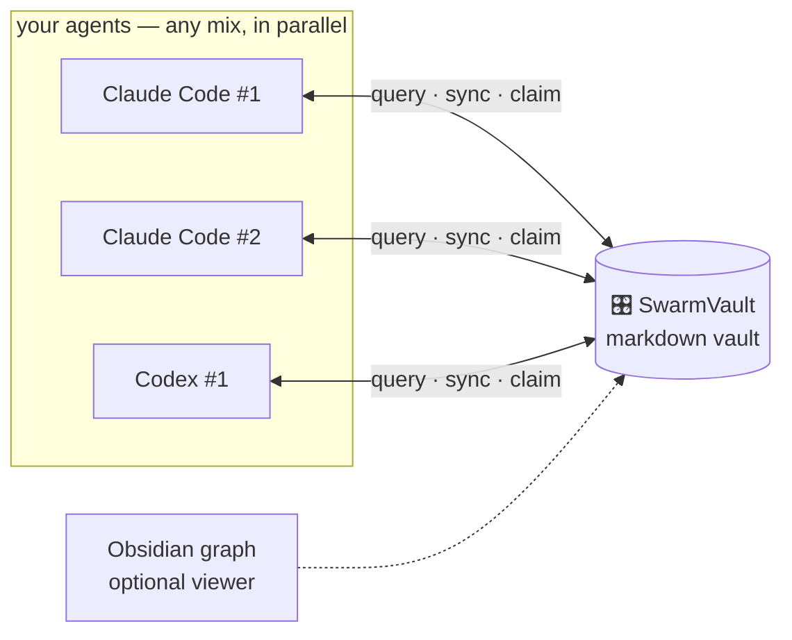

# 🎛️ SwarmVault

**Your AI agents does not synchronise. SwarmVault does.**

A shared knowledge vault + full software-engineering workflow for AI coding agents — run Claude Code and Codex in parallel with one memory, one plan.

> 📦 Zero dependencies · 📝 Plain markdown · 🕸️ Obsidian-optional graph ·
> 🆓 MIT

## The 60-second install

**Door 1 — let your agent do it** *(the fun one)*: paste this into Claude Code or Codex:

> Read https://github.com/AnmarHani/swarmvault/blob/main/INSTALL.md and
> integrate SwarmVault into my setup.

Your agent clones it, builds your vault, wires its own hooks, and asks you the three
questions that are actually yours to answer.

**Door 2 — script:** `git clone https://github.com/AnmarHani/swarmvault && cd swarmvault && ./install.sh`

**Door 3 — manual:** copy `skills/` into `.claude/skills/`, `scripts/` anywhere, and
follow [INSTALL.md](INSTALL.md) §3. It's all just markdown and one Python file.

## What you get

🧠 **A shared brain.** Every session starts already knowing the project: memory, plans,
decisions, open tickets — injected automatically (Claude Code hooks) or on request
(Codex). Say *"continue project X"* in a brand-new session and it resumes exactly where
any agent left off. No session archaeology, ever.

📐 **Real software engineering, enforced.** A minimal catalog of 11 skills walks projects
through the actual lifecycle: a relentless requirements interview (with a question queue
that never loses track) → SRS with EARS acceptance criteria and ISO 25010 NFRs → 
architecture + design-system docs with ADRs → dependency-ordered tickets → parallel
implementation with per-function tests → a strong-model review sweep at every milestone
that checks the *spec*, not just the code. Full traceability: requirement → ticket →
commit → test.

⚡ **True parallelism, no stepping on toes.** Tickets are claimed by atomic file
creation — the filesystem referees. Any mix of platforms, any number of agents; stale
claims from dead sessions get taken over cleanly.

💸 **Token-frugal by doctrine.** Query the vault (BM25, descriptions-first) instead of
re-reading the repo; offload state instead of carrying context; tier models to tasks
(no flagship models for boilerplate); compact machine-lane notes. All of it
quality-bounded: when quality needs tokens, it takes them.

🕸️ **A knowledge graph you can see.** Open the vault in [Obsidian](https://obsidian.md)
(optional!) and get the graph view, backlinks, and a pleasant reading experience over
everything your agents know. See [docs/obsidian-guide.md](docs/obsidian-guide.md).

## How it works

The vault is a plain folder: `10 Projects` (docs + maps) · `20 Memory` · `30 Plans`
(specs, tickets, question queues) · `40 Sessions` · `50 Decisions` (ADRs). One
zero-dependency script (`swarmvault.py`) gives every agent `query` / `sync` / `claim` /
`context`. The skills teach agents the contract.

**The flow** (via `/swarm-flow`, resumable from any point, gated-by-you or fully
autonomous — your choice):

`swarm-spec` → `swarm-design` (+ `swarm-design-ui`) → `swarm-implement` ⇄ `swarm-review`
· with `swarm-debug`, `swarm-init`, `swarm-migrate` (brownfield projects get *mined* into
the flow, not re-interviewed), and `swarm-skill-forge` alongside.

## FAQ

**Do I need Obsidian?** No. It's a beautiful optional lens; everything works with plain
files.

**Claude Code or Codex?** Both, first-class. The core is plain markdown + stock
Python 3, so other agent platforms are a thin adapter away.

**Does it phone home?** Never. No network calls, no telemetry, no services — files on
your disk.

**Existing project?** `swarm-migrate` registers it in minutes, and can optionally mine
your README/docs/tests/code into a draft spec with provenance and drop you mid-flow —
it asks before spending tokens.

**Windows?** Linux, macOS, and WSL are first-class; native Windows is best-effort.

## ⚠️ The fine print

SwarmVault stores knowledge as plain files and runs local scripts. **Auditing your
environment, installed packages, and the data you put in the vault is your
responsibility.** Project isolation flags are cooperative filtering between agents — not
a security boundary.

## Credits & license

The skills were written fresh for SwarmVault, but the techniques stand on excellent
prior work — see **[CREDITS.md](CREDITS.md)**. MIT — see [LICENSE](LICENSE).
