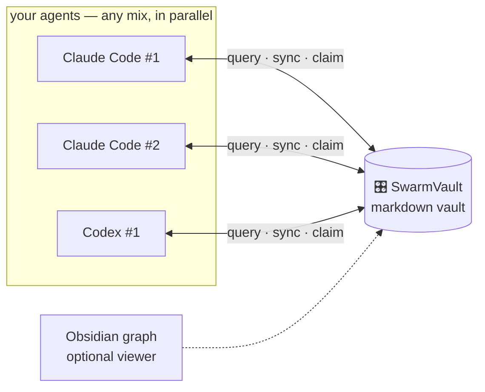

# 🎛️ SwarmVault

**Your AI agents don't synchronise. SwarmVault does.**

A shared knowledge vault + full software-engineering workflow for AI coding agents — run
Claude Code and Codex in parallel with one memory, one plan.

> 📦 Zero dependencies · 📝 Plain markdown · 🕸️ Obsidian-optional graph ·
> 🆓 MIT

## The 60-second install

**Door 1 — let your agent do it** *(the fun one)*: paste this into Claude Code or Codex:

> Read https://github.com/AnmarHani/swarmvault/blob/main/INSTALL.md and
> integrate SwarmVault into my setup.

Your agent clones it, builds your vault, wires its own hooks, and asks you the few
questions that are actually yours to answer.

**Door 2 — script:** `git clone https://github.com/AnmarHani/swarmvault && cd swarmvault && ./install.sh`

**Door 3 — manual:** copy `skills/` into `.claude/skills/`, `scripts/` anywhere, and
follow [INSTALL.md](INSTALL.md) §3. It's all just markdown and one Python file.

## What you get

🧠 **A shared brain.** Every session starts already knowing the project: memory, plans,
decisions, open tickets — injected automatically (Claude Code hooks) or on request
(Codex). Say *"continue project X"* in a brand-new session and it resumes exactly where
any agent left off. No session archaeology, ever.

📐 **Real software engineering, enforced.** A minimal catalog of 11 core skills (plus an
optional orchestration add-on) walks projects through the actual lifecycle: a clarifying,
options-first requirements interview (with a question queue that never loses track) → SRS
with EARS acceptance criteria and ISO 25010 NFRs → architecture + design-system docs with
ADRs → dependency-ordered tickets → parallel implementation with per-function tests → a
strong-model review sweep at every milestone that checks the *spec*, not just the code.
Full traceability: requirement → ticket → commit → test.

⚡ **True parallelism, no stepping on toes.** Tickets are claimed by atomic file
creation — the filesystem referees. Any mix of platforms, any number of agents; stale
claims from dead sessions get taken over cleanly.

⏳ **It outlives your usage limit.** Near your quota, an agent can — with your consent —
schedule a *"continue project X"* wake for when the limit resets, record it in the vault so
every session sees it, and self-clear it when the project's done. The vault holds all the
state, so the resumed session picks up cold without missing a beat.

🧭 **Smart, budget-aware orchestration.** The optional orchestrator sizes each task and reads
each platform's remaining usage, then routes big work to the platforms with the most headroom
and the model whose strengths fit the job (design vs planning vs coding vs review), keeping
depleted platforms for small work. One `board` command shows the whole swarm from whatever CLI
you're in — every agent's platform · model · effort · task · progress, plus usage/limits
(tokens, resets, weekly caps). Works for a single self-managing agent too.

💸 **Token-frugal by doctrine.** Query the vault (BM25, descriptions-first) instead of
re-reading the repo; offload state instead of carrying context; tier models to tasks
(no flagship models for boilerplate); compact machine-lane notes; and on long tasks, safe-state
compaction (`checkpoint` → clear → continue). All of it quality-bounded: when quality needs
tokens, it takes them.

🕸️ **A knowledge graph you can see.** Open the vault in [Obsidian](https://obsidian.md)
(optional!) and get the graph view, backlinks, and a pleasant reading experience over
everything your agents know. See [docs/obsidian-guide.md](docs/obsidian-guide.md).

## How it works



The vault is a plain folder: `10 Projects` (docs + maps) · `20 Memory` · `30 Plans`
(specs, tickets, question queues) · `40 Sessions` · `50 Decisions` (ADRs). One
zero-dependency script (`swarmvault.py`) gives every agent `query` / `sync` / `claim` /
`context`. The skills teach agents the contract.

**The flow** (via `/swarm-flow`, resumable from any point, gated-by-you or fully
autonomous — your choice):

`swarm-spec` → `swarm-design` (+ `swarm-design-ui`) → `swarm-implement` ⇄ `swarm-review`
· with `swarm-debug`, `swarm-init`, `swarm-migrate` (brownfield projects get *mined* into
the flow, not re-interviewed), `swarm-orchestrate` (optional autonomy), and
`swarm-skill-forge` alongside.

## FAQ

**Do I need Obsidian?** No. It's a beautiful optional lens; everything works with plain
files.

**Claude Code or Codex?** Both, first-class and verified. The optional orchestrator can also
*launch* more agents through a declarative adapter registry: best-effort defaults for Gemini
CLI, OpenCode, Droid, Cursor, and Copilot (verify the flags for your version), and a
`--launch-cmd` template to wire *any* other CLI agent — Windsurf, Kiro, Trae, Continue,
Augment, Warp, and the rest. Anything can also just join as a cooperative worker on the shared
vault. The core is plain markdown + stock Python 3.

**What happens when I hit a usage limit?** Nothing is lost. Near the limit an agent asks
whether to keep going after it resets — until the whole project finishes, or a point you
name — and if you say yes it schedules a native *"continue project X"* wake at the reset
time and records it in the vault (`plan-continue`). Any session, on any platform, sees the
pending continuation; it self-clears when the work is done. You're always asked first.

**Is the orchestrator/daemon enabled by default?** No. The standard installation never
starts a daemon: the vault, skills, claims, and parallel-worker workflow remain fully
manual/cooperative and service-free. To opt in for a registered project, choose how many
workers of each platform to run (and whether they may write), then enable and start the
local supervisor:

```bash
python3 /path/to/swarmvault.py supervisor configure --project MyApp --platform codex --max-workers 2 --model <model> --allow-write
python3 /path/to/swarmvault.py supervisor configure --project MyApp --platform claude-code --max-workers 2 --model <model> --allow-write
python3 /path/to/swarmvault.py supervisor enable --project MyApp
python3 /path/to/swarmvault.py supervisor start --project MyApp
```

`--allow-write` is an explicit per-platform authorization; omit it for read-only workers.
`supervisor status --project MyApp` shows the local process and durable worker state;
`supervisor stop --project MyApp` stops it, and `supervisor disable --project MyApp` prevents
future starts. `orchestrate --project MyApp` performs one reconciliation without a daemon.
See [swarm-orchestrate](skills/swarm-orchestrate/SKILL.md) for the full protocol.

> Or just tell your AI agent to enable it for you!

**Does it phone home?** Never. No network calls, no telemetry, no services — files on
your disk.

**Existing project?** `swarm-migrate` registers it in minutes, and can optionally mine
your README/docs/tests/code into a draft spec with provenance and drop you mid-flow —
it asks before spending tokens.

**Windows?** Linux, macOS, and WSL are first-class; native Windows is best-effort.

## ⚠️ The fine print

SwarmVault stores knowledge as plain files and runs local scripts. **Auditing your
environment, installed packages, and the data you put in the vault is your
responsibility.** Project isolation flags are cooperative filtering between agents — not
a security boundary.

## Credits & license

The skills were written fresh for SwarmVault, but the techniques stand on excellent
prior work — see **[CREDITS.md](CREDITS.md)**. MIT — see [LICENSE](LICENSE).
